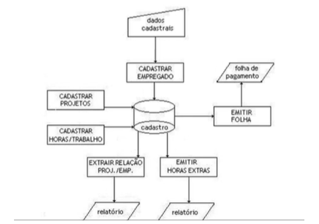
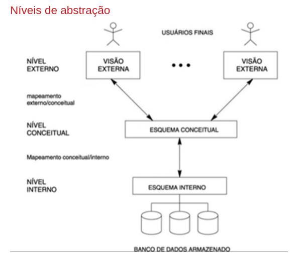

# 03/12/2024 - CURSO DBA IFRS - DAY 1

## 1 Banco de Dados: conceitos

## 1.1 Fundamentos de BD

### Contexto
Bancos de dados são essenciais para armazenar dados utilizados em dispositivos informacionais, como smartphones, computadores, roteadores, documentos digitais e físicos. Eles são aplicáveis a praticamente todas as áreas da computação.

### Conceitos Fundamentais

#### **Dado:**  
Representação de uma informação ou fato do mundo real com significado no contexto de uma aplicação.  

**Exemplo:** data de nascimento.  

#### **Informação:**  
Significado extraído de um dado.  

**Exemplo:** idade, obtida a partir da data de nascimento.

### Bancos de Dados
**Definições:**

1. Equivalente eletrônico de um armário de arquivamento.  
2. Coleção de dados relacionados.  
3. Conjunto de dados inter-relacionados representando informações sobre um domínio específico. *(Adotado neste curso)*  

Um banco de dados é projetado para modelar e representar informações que têm significado em um domínio específico.

### Sistema de Banco de Dados (SBD)
É um subsistema computadorizado de manutenção de registros, composto por:  
- **Dados:** informações armazenadas.  
- **Software:** programas para gerenciar, acessar e proteger dados.  
- **Hardware:** dispositivos onde os dados são armazenados (HD, SSD).  
- **Pessoas:** usuários finais, programadores e administradores.  

O SBD funciona de forma sistêmica, com interação entre software, hardware, dados e pessoas para garantir a integridade e disponibilidade dos dados.

### Sistema Gerenciador de Bancos de Dados (SGBD)

**Componentes:**

1. **Dados:** integrados e compartilháveis.  
2. **Software:** interface entre usuários e dados, com gerenciadores para controle de segurança e acesso.  
3. **Hardware:** onde os dados estão fisicamente armazenados.  
4. **Pessoas:**  
   - Usuários finais.  
   - Programadores de aplicativos.  
   - Administradores de banco de dados.  

### Ferramentas de Apoio
- Carga inicial.  
- Backup e restauração.  
- Reorganização de dados.  
- Estatísticas e análises.  
- Catálogo de metadados.  

## Evolução dos Bancos de Dados
1. **1ª Geração:** Arquivos independentes, sem integração entre dados e processos.  
2. **2ª Geração:** Arquivos integrados, permitindo acesso centralizado para relatórios.  

3. **3ª Geração:** Introdução de conceitos como identificadores de cadastro, aproximando-se do modelo atual.  
4. **4ª Geração:** Processamento ampliado, com evolução de hardware e ferramentas, resultando nos sistemas robustos usados hoje.

Os bancos de dados atuais oferecem funcionalidades amplas, possibilitando a gestão eficiente de dados em diversas aplicações.

## 1.2 Fundamentos de BD

## Sistema de Banco de Dados (SBD)

### Características
- **Natureza autodescritiva**: Os próprios dados armazenados descrevem o sistema.
- **Isolamento entre programas e dados**: Atualizações no sistema não afetam os dados armazenados.
- **Suporte a múltiplas visões dos dados**: Diferentes níveis de acesso para administradores, programadores e usuários finais.
- **Compartilhamento de dados e transações de multiusuários**: Coordenação de acessos e atualizações simultâneas, garantindo consistência e integridade.

---

## Por que usar Banco de Dados?

1. **Densidade**: Reduz a necessidade de arquivos físicos ou digitais extensos.
2. **Velocidade**: Obtenção e atualização de dados de forma rápida.
3. **Agilidade**: Máquinas realizam tarefas repetitivas de forma eficiente.
4. **Atualidade**: Garante dados precisos e atualizados.
5. **Proteção**: Dados protegidos contra perda e acesso não autorizado.

---

## Controle Centralizado

### Papéis principais:
- **Administrador de dados**: Define quais dados armazenar e entende o contexto do domínio.
- **Administrador de bancos de dados**: Cria bancos, define estruturas, implementa controles e garante desempenho.

> Em alguns casos, um profissional pode assumir ambos os papéis.

---

## Vantagens do Banco de Dados

- Dados compartilháveis.
- Redução de redundância.
- Evita inconsistências.
- Suporte a transações.
- Mantém a integridade dos dados.
- Reforça a segurança.
- Equilibra requisitos contraditórios.
- Impõe padrões (e.g., formato de datas ou CPF).

---

## Arquitetura de Três Esquemas

### Objetivo
Separar o usuário e a aplicação do armazenamento físico por meio de níveis de abstração.

### Níveis:
1. **Visões do usuário**: 
   - Nível mais próximo dos usuários finais; representa a visão individual dos dados.
2. **Conceitual**: 
   - Representação abstrata, descrevendo dados e relacionamentos, sem detalhes físicos.
3. **Físico**: 
   - Relaciona-se ao armazenamento e acesso físico dos dados no disco.

---

### Benefícios da Arquitetura
- Facilita o entendimento e a manipulação dos dados.
- Garante flexibilidade na visualização e no armazenamento.
- Promove independência entre níveis de abstração.
